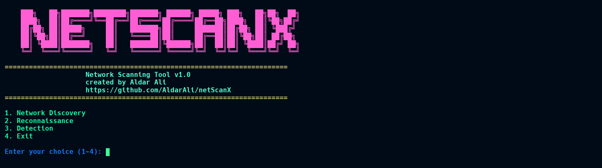

# netScanX


A comprehensive network scanning and security analysis tool for Linux environments.

## Overview

netScanX is a command-line utility that provides network discovery, reconnaissance, and attack detection capabilities.

## Features

### 1. Network Discovery
- **Device Discovery**: Scan local networks to find all connected devices
- **Port Scanning**: Identify open ports and running services on target systems
- **Wi-Fi Network Scanning**: Detect available wireless networks and their security configurations

### 2. Reconnaissance
- **MAC Address Lookup**: Get vendor information for devices based on MAC addresses
- **Network Device Selection**: Scan network and select specific devices for analysis

### 3. Attack Detection
- **ARP Spoofing Detection**: Identify potential ARP poisoning attacks on your network
- **TCP SYN Flood Detection**: Monitor for possible TCP SYN flood attacks

## Installation

1. Clone the repository:
   ```
   git clone https://github.com/AldarAli/netScanX.git
   cd netScanX
   ```

2. Create and activate a virtual environment:
   ```
   python3 -m venv .venv
   source .venv/bin/activate
   ```

3. Install dependencies:
   ```
   pip install -r requirements.txt
   ```

4. Configure your environment:
   - Create .env file and add your API key for MAC address lookups MAC_ADDRESS_API_KEY='your_api_key' https://macaddress.io/
   - Make sure your API key is set in the .env file for MAC address lookups
   - Adjust settings in configuration.ini as needed (especially the WiFi interface)

## Usage

Run the main script:

```
sudo python cli.py
```

Root privileges are required for many of the scanning and detection features.

### Main Menu

The application offers a text-based menu with the following options:

1. **Network Discovery**
   - Discover Network Devices
   - Scan for Open Ports
   - Scan for Wi-Fi Networks

2. **Reconnaissance**
   - Scan Network and Select MAC Address
   - Enter MAC Address Manually

3. **Detection**
   - Detect ARP Spoofing
   - Detect TCP SYN Flood


## Security Notes

- This tool is intended for legitimate network security analysis on networks you own or have permission to test
- Running network scans without appropriate authorization may violate laws and regulations
- Always ensure you have proper authorization before scanning any network

## Configuration

Default configuration is stored in configuration.ini. You can modify:

- WiFi interface name
- Color scheme for the interface
- Logging preferences

## License

This project is licensed under the MIT License - see the LICENSE file for details.